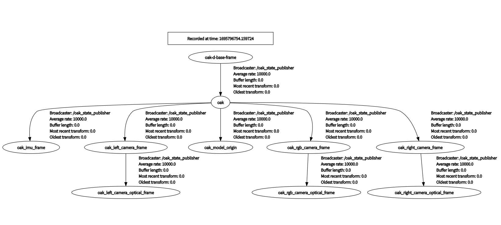

# ROS Bag Documentation

ROS Bag file link : [[link]](https://drive.google.com/file/d/1aWoqXuSCk5GDxvghb0yQAMQ4kH8yGFQA/view?usp=share_link)

## Topic information
The following is the recorded sensor topic in rosbag 

### Sensor data
* /oak/left/image_raw (sensor_msgs/Image)
* /oak/left/camera_info(sensor_msgs/CameraInfo)
* /oak/right/image_raw (sensor_msgs/Image)
* /oak/right/camera_info(sensor_msgs/CameraInfo)
* /oak/imu/data (sensor_msgs/Imu)
* /oak/nn/detections (vision_msgs/Detection3DArray)

The following is the brief description of sensor data collected.

* Stereo Images
  * 400p (400x640px)
  * 480p is not available option for [OV9282](https://docs.luxonis.com/projects/hardware/en/latest/pages/articles/sensors/ov9282.html#ov9282) image sensors
  * auto-exposure
* IMU
  * default setting (not sure)
* Yolo BBox
  * in depthai custom message
  * BBox is collected by inference on 1080p(720x1080px)image
  * when fusing bbox info with mono-images, (definitely) need to transform BBox scale(*note1)

### TF
* /tf (tf2_msgs/TFMessage.msg)
* /tf_static (tf2_msgs/TFMessage.msg)




## Coordinate Transformation

The main coordiante system we will use are 

* oak-d_base_frame (oak)
* oak_imu_frame
* oak_left_camera_frame
* oak_right_camera_frame

```
# get tf between 2 coordinates
# oak-d_base_frame is identical with oak

rosrun tf tf_echo oak oak_imu_frame
rosrun tf tf_echo oak oak_left_camera_frame
rosrun tf tf_echo oak oak_right_camera_frame
```

### oak-D base_frame to oak_imu_frame

```
- Translation: [0.000, -0.015, -0.014]
- Rotation: in Quaternion [0.000, 0.707, 0.000, 0.707]
            in RPY (radian) [3.142, 1.571, 3.142]
            in RPY (degree) [180.000, 90.000, 180.000]
```

### oak-D base_frame to oak_left_camera_frame
```
- Translation: [0.000, 0.037, 0.000]
- Rotation: in Quaternion [0.000, 0.000, 0.000, 1.000]
            in RPY (radian) [0.000, -0.000, 0.000]
            in RPY (degree) [0.000, -0.000, 0.000]
```

### oak-D base_frame to oak_right_camera_frame
```
- Translation: [0.000, -0.037, 0.000]
- Rotation: in Quaternion [0.000, 0.000, 0.000, 1.000]
            in RPY (radian) [0.000, -0.000, 0.000]
            in RPY (degree) [0.000, -0.000, 0.000]
```

## Calibration parameter
You can either calibration parameter from device or set it manually by config file. 

### automatic setting
Just do not specify any calibration parameter in camera parameter file for `camera.launch`

```
stereo_inertial.yaml
.
.
left_i_calibration_file: ''
.
.
right_i_calibration_file: ''
.
.
```

### manual setting
Need to specify calibration parameter in yaml files.
```
depthai_ros_driver/config/calibration/left.yaml
depthai_ros_driver/config/calibration/right.yaml
```

## Command
The following are the command used to record rosbag.
```
rosbag record -o imu_stereo_yolo.bag /oak/imu/data /oak/left/image_raw /oak/right/image_raw /oak/nn/detections /tf /tf_static
```

```
rosbag record -o imu_stereo_yolo.bag /oak/imu/data /oak/left/camera_info /oak/left/image_raw /oak/right/camera_info /oak/right/image_raw /oak/nn/detections /tf /tf_static
```